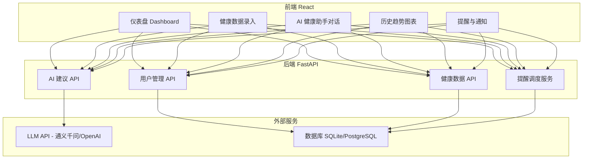

# Lab2 — 办公室健康监测系统 实现计划

## 项目概述

基于大模型技术的 **办公室健康监测系统**，实时监测员工健康状态（心率、活动量、久坐提醒等），集成 AI 提供个性化健康建议，B/S 架构，两轮迭代开发。

---

## 技术栈选型

| 层级 | 技术 | 理由 |
|------|------|------|
| **前端** | React + Vite + Ant Design | 现代化、组件丰富、图表支持好 |
| **后端** | Python FastAPI | 轻量高性能，适配 AI 模型调用 |
| **数据库** | SQLite（原型）→ PostgreSQL（迭代2） | 零配置起步，后期可平滑迁移 |
| **AI/LLM** | OpenAI API / 通义千问 API | 生成健康建议、智能问答 |
| **图表** | ECharts / Recharts | 心率、活动量等数据可视化 |
| **部署** | 本地 Docker / 云服务器 | 满足演示需求 |

---

## 系统架构



---

## 核心功能模块

### 模块 1：用户管理
- 注册 / 登录 / 个人信息（身高、体重、年龄、职业）
- JWT 鉴权

### 模块 2：健康数据采集与展示
- **手动录入**：心率、血压、体重、睡眠时长、饮水量、运动步数
- **仪表盘**：实时数据卡片 + 趋势折线图
- **历史记录**：按日/周/月查看健康数据变化

### 模块 3：AI 健康助手（LLM 集成）
- 基于用户健康数据 + 个人信息，调用 LLM 生成**个性化健康建议**
- **对话式交互**：用户可以向 AI 提问（"我最近血压偏高怎么办？"）
- AI 根据历史数据趋势给出**周报/月报**总结

### 模块 4：智能提醒
- **久坐提醒**：基于活动量数据，超过阈值自动提醒
- **喝水提醒**：定时提醒
- **异常预警**：心率/血压超出正常范围时弹出警告 + AI 建议

### 模块 5：数据报告
- 生成可下载的**健康报告 PDF**
- 包含 AI 分析总结 + 数据图表

---

## 迭代计划

### 🔵 第一次迭代（第 3-6 周）— 30% 分值

> 目标：**可运行的原型系统**，覆盖核心功能

| 周次 | 任务 |
|------|------|
| 第 3 周 | 项目初始化、数据库设计、用户注册/登录 API + 前端登录页 |
| 第 4 周 | 健康数据 CRUD API + 前端数据录入页 + 仪表盘页面 |
| 第 5 周 | LLM API 对接 + AI 健康建议功能 + AI 对话页面 |
| 第 6 周 | 整合测试、Bug修复、部署、**演示准备** |

**第一次迭代交付物**：
- [x] 用户注册/登录系统
- [x] 健康数据手动录入与展示（仪表盘 + 历史图表）
- [x] AI 健康建议（调用 LLM 根据用户数据生成建议）
- [x] 基础前端界面（登录页、仪表盘、数据录入页、AI对话页）

---

### 🟢 第二次迭代（第 7-8 周）— 60% 分值

> 目标：**完善系统**，增加高级功能、提升 UI、编写测试

| 周次 | 任务 |
|------|------|
| 第 7 周 | 智能提醒系统 + 异常预警 + 健康周报/月报 + PDF导出 |
| 第 8 周 | UI 美化 + 单元测试 + 集成测试 + 覆盖率报告 + 部署优化 |
| 第 9 周 | **答辩准备**、最终演示 |

**第二次迭代交付物**：
- [ ] 久坐/喝水/异常智能提醒
- [ ] AI 生成周报/月报
- [ ] PDF 健康报告导出
- [ ] 完整的测试用例 + 覆盖率报告（pytest + coverage）
- [ ] 前端响应式适配（移动端/PC）
- [ ] 部署到云服务器或 Docker

---

## 数据库设计（ER 草案）

```
users
├── id (PK)
├── username
├── password_hash
├── name, age, gender, height, weight, occupation
└── created_at

health_records
├── id (PK)
├── user_id (FK → users)
├── record_date
├── heart_rate, systolic_bp, diastolic_bp
├── weight, sleep_hours, water_intake, steps
└── created_at

ai_conversations
├── id (PK)
├── user_id (FK → users)
├── role (user/assistant)
├── content
└── created_at

reminders
├── id (PK)
├── user_id (FK → users)
├── type (sedentary/water/abnormal)
├── message, triggered_at
└── is_read
```

---

## 项目目录结构

```
Lab2/
├── frontend/               # React + Vite
│   ├── src/
│   │   ├── pages/          # Login, Dashboard, DataEntry, AIChat, Reports
│   │   ├── components/     # Chart, DataCard, Navbar, ReminderPopup
│   │   ├── api/            # axios 请求封装
│   │   └── App.jsx
│   └── package.json
├── backend/                # FastAPI
│   ├── app/
│   │   ├── main.py         # 入口
│   │   ├── models.py       # SQLAlchemy 模型
│   │   ├── schemas.py      # Pydantic 数据校验
│   │   ├── routers/        # users.py, health.py, ai.py, reminders.py
│   │   ├── services/       # ai_service.py, reminder_service.py
│   │   └── database.py     # DB 连接
│   ├── tests/              # pytest 测试
│   └── requirements.txt
├── docs/                   # 需求文档、设计文档
└── README.md
```

---

## 分工建议（3人团队）

| 角色 | 负责模块 |
|------|---------|
| **前端负责人** | React 页面开发、UI设计、图表组件、响应式适配 |
| **后端负责人** | FastAPI 接口、数据库、鉴权、提醒调度 |
| **AI+测试负责人** | LLM API 对接、AI 建议算法、测试用例编写、覆盖率 |

---

## GitHub 管理要求

- 仓库名：`Office-Health-Monitor`（组账户下）
- 分支策略：`main` → `iter1`（第一轮迭代）、`iter2`（第二轮迭代）
- 使用 GitHub Projects 做任务墙（Kanban）
- 使用 GitHub Issues 跟踪用户故事和 Bug
- 交叉 Code Review（Pull Request + 评注）

---

## 验证计划

### 自动化测试
- **后端**：`pytest` + `httpx`（测试 API 端点）
- **覆盖率**：`pytest-cov`，目标 ≥ 70%
- **前端**：`vitest` 组件测试


---

## 审美重构：Frontend Taste (前端品味) 升维

为了摆脱常见的“AI 模板感（AI Slop）”，本系统深度应用了 Github 级项目标杆的 **Frontend Taste (前端品味)** 规范，打造出世界级的专业界面质感：

### 核心视觉策略
- **Typography (字体排版)**: 彻底弃用常规的 Inter 字体。选用先锋感极强的 `Syne` 字体作为关键数据的展示字体，辅以 `Space Grotesk` 作为基础无衬线文本，通过极度差异化的字体组合拉升界面档次。
- **Asymmetrical Bento (非对称折叠网格)**: 摒弃死板的均分网格结构。重新引入 12 列高级异步网格系统（如跨越 7 列和 5 列的非对称动态排版），通过受控的留白与比例失衡创造出色的视觉张力。
- **Deep Obsidian (深空黑曜石质感)**: 取消俗套的彩虹渐变，将系统底色下沉至纯墨黑（`#050505`）。点缀极高对比度的电光蓝与荧光黄，强化核心指标数据。
- **Texture & Depth (微触感与纵深)**: 在暗色背景之上叠加 4% 透明度的胶片噪点（Film Grain）滤镜与多层交叠的网格渐变（Mesh Gradient），打破纯色背景的空洞感，营造出高级的物理纵深空间。

### 质量与架构保障
- 坚如磐石的后端数据边界校验（借助 Pydantic 过滤无效生理数据，防御负数爆破异常）。
- 基于 `.env` 全隔离的大模型 API 调用，彻底消除安全硬编码漏洞。
- 高可用性全链路单元测试护航（Pytest 核心测试点全部通关）。
